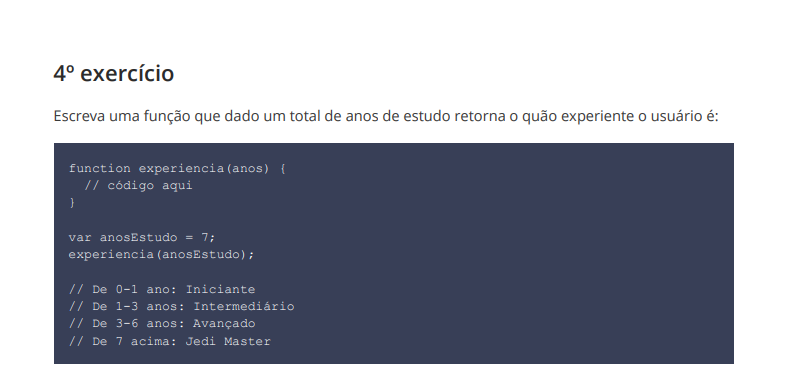
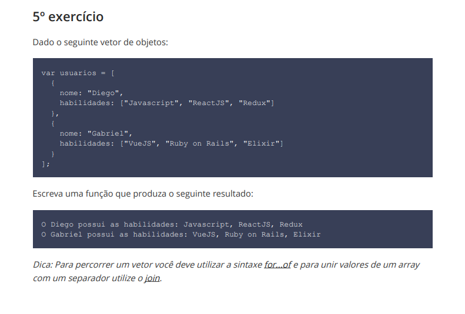
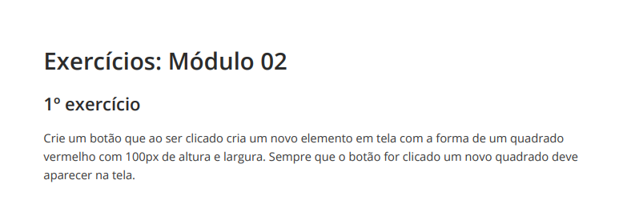
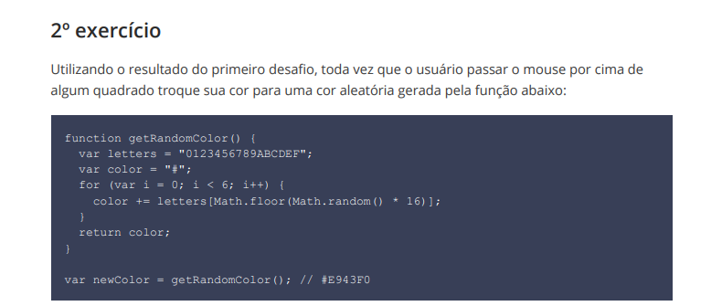
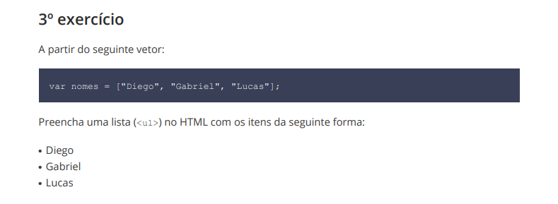
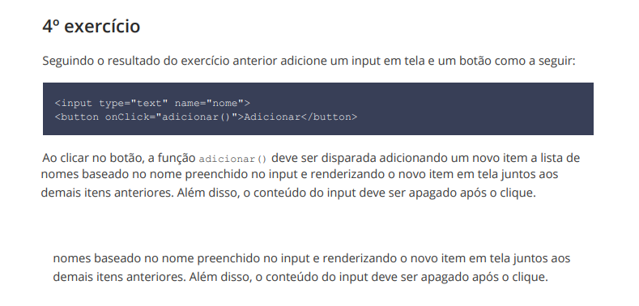
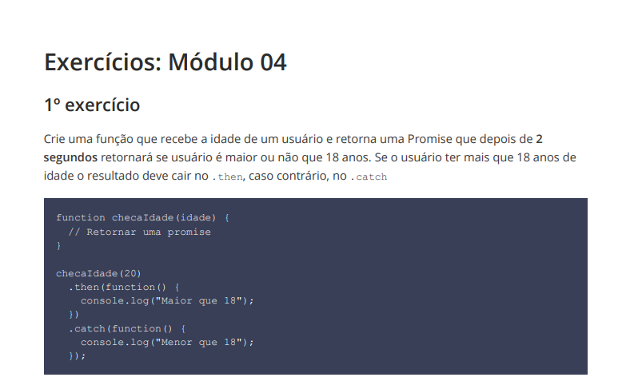
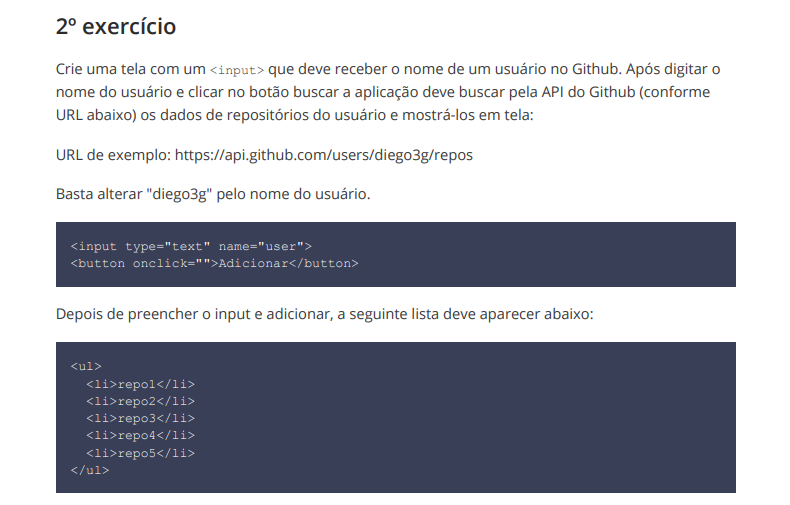
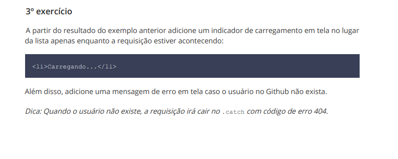

# Starter-Rocketseat

## 📋 Índice

- [Modulo 1](#-Modulo-1)
- [Modulo 2](#-Modulo-2)
- [Modulo 4](#-Modulo-4)

---

## Modulo 1

  

 

  

 

  

 

  

 

  

## Modulo 2
 

  

 

  

 

  

 

  

## Modulo 3
 

  

 

  

 

  

 
